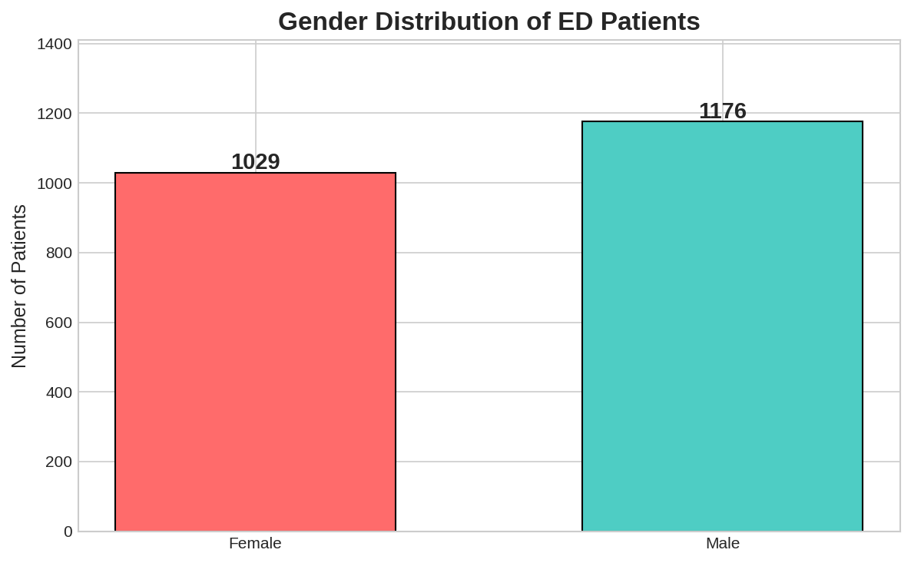
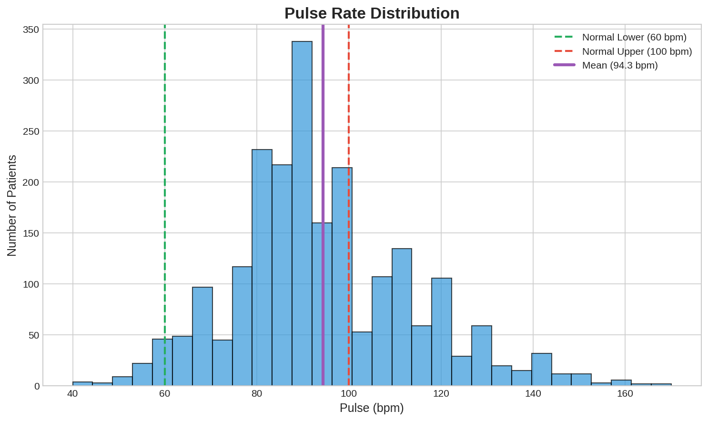
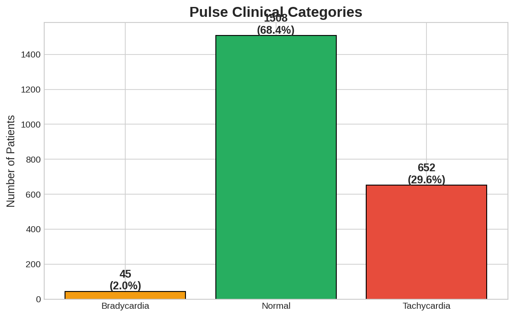

# Assignment 3 - Data Visualization

## Objective

Create clinically meaningful visualizations from the cleaned Emergency Triage Dataset.

---

## Visualizations

### 1. Gender Distribution



The dataset has a balanced gender distribution with slightly more male patients.

---

### 2. Pulse Distribution



The pulse distribution shows:
- Mean pulse: ~88 bpm (within normal range)
- Right-skewed distribution
- Many patients with tachycardia (>100 bpm)

---

### 3. Pulse Clinical Categories



Clinical breakdown of pulse readings:
- **Bradycardia (<60 bpm):** ~5% of patients
- **Normal (60-100 bpm):** ~60% of patients  
- **Tachycardia (>100 bpm):** ~35% of patients

---

## Key Insights

| Finding | Clinical Significance |
|---------|----------------------|
| Balanced gender distribution | Dataset is representative |
| Mean pulse ~88 bpm | Within normal range |
| 35% tachycardia | Common in ED due to stress/pain |
| Weak age-pulse correlation | Pulse abnormalities affect all ages |

---

## Files

| File | Description |
|------|-------------|
| `Week0_Tutorial3_Visualisation.ipynb` | Jupyter notebook with all visualizations |
| `images/` | Folder containing generated charts |

---

## Technical Details

```python
# Visualization libraries used
import pandas as pd
import numpy as np
import matplotlib.pyplot as plt

# Style
plt.style.use('seaborn-v0_8-whitegrid')
```

---

**Author:** CariSurg MedTech Pathways | Week 0
